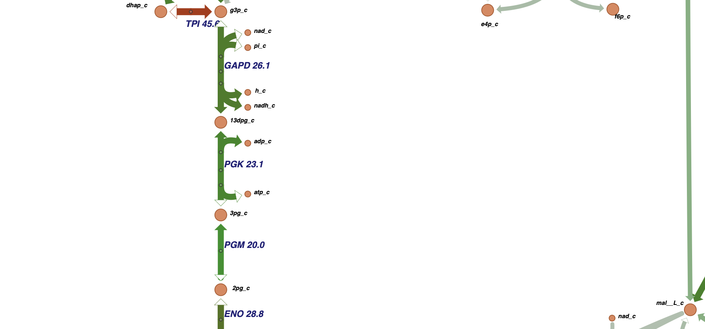
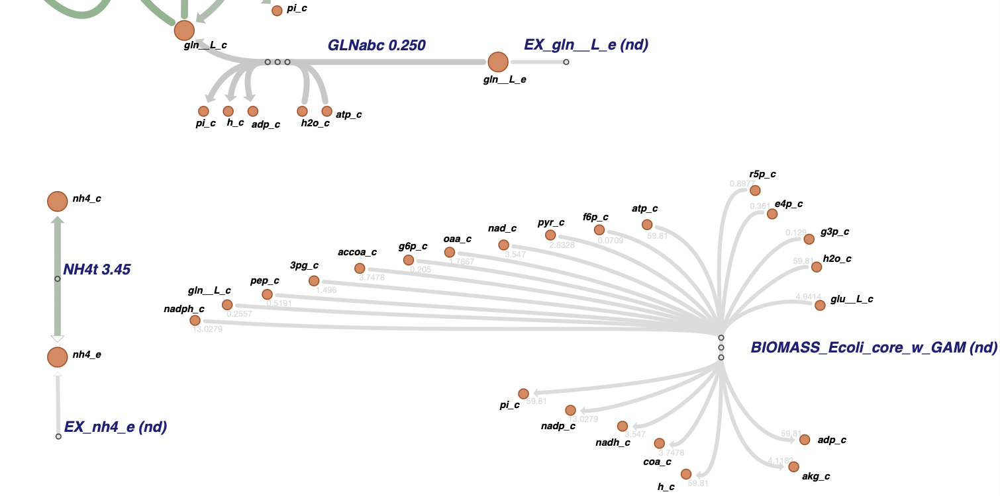

# 1a: 
The maximal reaction values are generally not equal along the linear metabolic pathways. For example consider figure  This part of the glucolysis pathway retained same fluxes between GAPD:PKG and PGM:ENO in the interactive session. However, the values are clearly different now! This could be because maximal reaction value is not the same as steady state flux and therefore, doesn't have to retain the mass balance property. While steady state flux are dictated by the Linear Optimization under stochoimetric constraint modeling; The maximal activation values of reactions, on the other hand, are dictated by enzyme availability derived from gene expressions.

# 1b:
I have found 2 reaction types that don't have data in the gene expression data. The 2 reaction types are EXCHANGE & BIOMASS reactions. As shwon on figure:  Any exchange and THE biomass reaction don't have any data avaialble. This makes absolute sense since Exchange reactions exist to maintain mass balance in the system and are there purely for mmodeling purpose; while biomass reaction flux is our objective function, a byproduct of network capabilities defined (among others) by gene expressions.

# 2
For this one we just loaded the model like in practical and manually set the upper & lower bounds as per instructions.

# Use of GenAI
Coopilot to help with using the many many different python functions. Essentially I would write in a comment what I want to acheive and let the copilot do the job. That way me (human) did all the conceptual and decision making work while not having to code much (I can't).