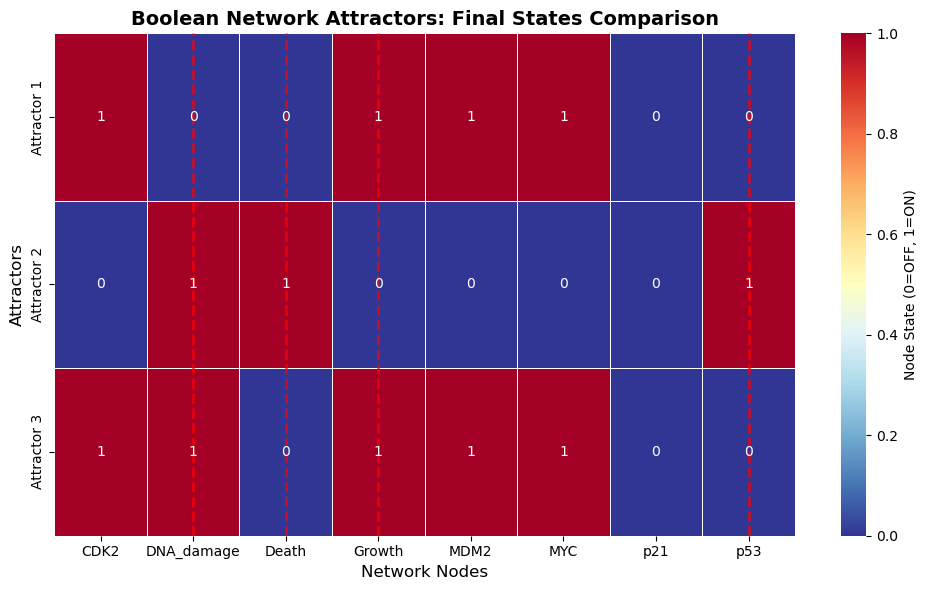

# Part 1: Normal State - Scenario Analysis & Attractor Analysis
This section serves as an overview of the initial & steady states of the normal cell regulatory network. Understanding how the cell evolves under Healthy, Stressed (damaged) & Oncogenic conditions within the base settings is important to understand itrs behaviour as a result of mutations.

Lets start with overview of the scenerios we base our analysis on. 
 
On this figure, the initial state scenarios are shown as the column at time t=0. The figure, also shows their evelution until a sterady state is reached following the base network rules. Zooming back in to states at time t=0, we can see that they only differ by one binary variable in each scenario, this small difference is however substential. The Stressed state differs from Healthy state by being initialized with DNA damage, while Oncogene Hijicked state differes by having MYC initlizied from the beggining.

At first glance it might seem like the healthy and onccogenic are the same. However, its the premature initialization of MYC gene that sets them apart. This is important since, in the base network, MYC is only activated if p53 and p21 are not active, essentially the oncogenic state skips this prerequisit and starts growing regarless. Another important observation is that while Stressed state results in celluar death, its by all means a natural and expected behaviour following DNA damage. In fact, its this uncontrolled growth and faulty apostasis mechanizm that results in the spread of cancerous cells.

As a result of this network settings we can find 3 distinct Attractor States: 
 

In a way they also corespond to the 3 scenerios we just went over. The first attractors is just a health state of cell Proliferation. The second attractor is an expected state of DNA damage-induced Apoptosis, a healthy reaction to DNA damage. The last state is the most interesting one. There are some intial states which lead to a problematic situation where a cell is growing despite DNA damage. It suggest that under the current network settings, it is possible to overcome the healthy DNA damage-induced Apoptosis mechanism and cause uncontrolled spread of damaged cells.

 
Luckily, as shown by the attractor basin figure, the third Oncogenic state is quite rare - at only 3.1% of all intial conditions. It seems to be the case that the more inital states end up in this dangerous steady state, the more dangerous the mutation becomes.

# Part 2: Mutation A - Scenario Analysis & Attractor Analysis
This mutation knocks out p53 a vital "tumor supressor" gene. This gene is responisble for both starting Apostasis and Inhibiting celluar growth, describted in the tutorial as a 'safety switch'. Let's see what happens to a cell without a safety switch.

1. Scenario Analysis: 
As expected, under scenario 2: the stressed cell, safety switch is not activated (Unlike in the normal network settings) and the cell started growing despite DNA damage, no oncogenic hijacking is needed. Since the healthy and hijacked states didn't activate p53 in the original network, their evolution remains unchanged.

2. Attractor Analysis:  

As a result of this change one attractor comletely disappeared. This is because attractor 2 in the original network was the one coresponding to controlled DNA damage-induced Apoptosis; and celluar death has p53 as its prerequisite. What remains are just the healthy cell Proliferation & and Damaged cell Proliferation states.

Looking at the attractor basin we can see that Damaged cell proliferation subsituted all the cases where normally DNA damage-induced Apoptosis would appear; bringing the total share of initial conditions result in Damaged cell Proliferation to a whooping 50%. A over 16 FOLD increase in likelihood to reach a cancer-like steady state.

# Part 3: Mutation B - Scenario Analysis & Attractor Analysis
This mutation amplifies MYC, an oncogene that stimulates uncontrolled cell growth. Under physiological conditions, MYC activity is tightly regulated by p53 and p21, but the amplification makes it permanently active, bypassing normal checkpoints.

1. Scenario Analysis: 
We can see how in all three cases the cell proliferates normally.
This occurs because MYC is artificially locked ON, which promotes CDK2 activity and cell cycle progression, even in the presence of p53.

The fundamental difference compared to the loss of p53 (mutation A) is that in this case, p53 is still present and potentially active, but its influence is eliminated by the constant MYC signaling. This allows p53 to be expressed, but its effects are overridden.

2. Attractor Analysis:   
This mutation contains four attractors, in which we observe two biologically interpretable states:
The first is healthy proliferation (Attractor 1), while the second is growth despite DNA damage (Attractor 3, oncogenic).
Additionally, there is a DNA damage-induced apoptosis attractor (Attractor 4) and an unusual "conflict" attractor (Attractor 2) in which p53 is active but no effect is observed.

Each attractor has the same 25% probability, meaning that oncogenic proliferation now has a 25% chance of dominating the initial conditions. Importantly, apoptosis remains possible, but its probability is reduced compared to the wild-type network, while abnormal proliferative states gain more space, making the cell more unstable.

# Part 4: Mutation C - Scenario Analysis & Attractor Analysis
This mutation forces MDM2, a negative regulator of p53, to be constantly overexpressed. Because MDM2 suppresses p53, this creates a scenario in which the cell's perception of stress is misperceived, no longer triggering a defense response.
1. Scenario Analysis: 
As expected, in all three scenarios, the cell proliferates. Even with DNA damage, p53 is unable to effectively trigger cell death, so growth continues unchecked.

2. Attractor Analysis:  
We can again observe four attractors, very similar to the case of MYC amplification:
Attractor 1 represents healthy proliferation, while attractor 3 represents growth despite DNA damage. Next, attractor 4 represents DNA damage-induced apoptosis, and finally, attractor 2 is a conflict state with unusual p53 activity. We can therefore deduce that apoptosis has not completely disappeared, but has been weakened.

Each attractor has the same 25% weight as MYC amplification, this mutation creates a strong propensity toward proliferation and cancer-like steady states, while reducing the robustness of apoptosis.
# Part 5: Mutation D - Scenario Analysis & Attractor Analysis
This mutation eliminates p21, an important effector of p53. Normally, p21 arrests the cell cycle by inhibiting CDK2, acting as a brake. Without p21, even if p53 is intact, growth control is partially compromised.
1. Scenario Analysis: 
We can observe how the healthy cell continues to proliferate, while the stressed cell undergoes apoptosis, since p53 is still present and can be activated by DNA damage.
Finally, we see how the oncogene-hijacked cell proliferates despite DNA damage, highlighting how the loss of p21 weakens growth suppression.

2. Attractor Analysis:  
We identified three actuators, the first is that of healthy proliferation (attractor 1), the second is that of apoptosis induced by DNA damage (attractor 2) and the third is growth despite DNA damage (attractor 3).

Analysis of the basin shows that proliferation is dominant (80%), while apoptosis is much less frequent (15%). Oncogenic proliferation does exist, but it is a minor attractant. Therefore, p21 knockout partially compromises cell cycle control but does not completely disable the apoptotic safeguard.

# Final Questions:
1. Which mutation is most dangerous and why? Provide quantitative evidence.

2. Explain the role of feedback loops (e.g., MYC → MDM2 → p53)

3. What are the limitations of this Boolean network model? Discuss 3 specific limitations.
