# Part 1
When we run the model for 4 hours, the red pathogen remains essentially localized in its starting position but releases a substance that diffuses into the lamina. This substance causes a rapid reduction in the stability of the green cells' cell walls, causing the cells to visually change from a bright green to a yellow/olive/brown color. The color change progressively extends across a large portion of the tissue, already evident after the first hour and becoming widespread after a few hours. Therefore, the damage does not occur through physical invasion of the pathogen, but rather through the diffusion of the substance, which weakens the cells from a distance.

Below we can see how the model changes in 4 hours:

t=0:
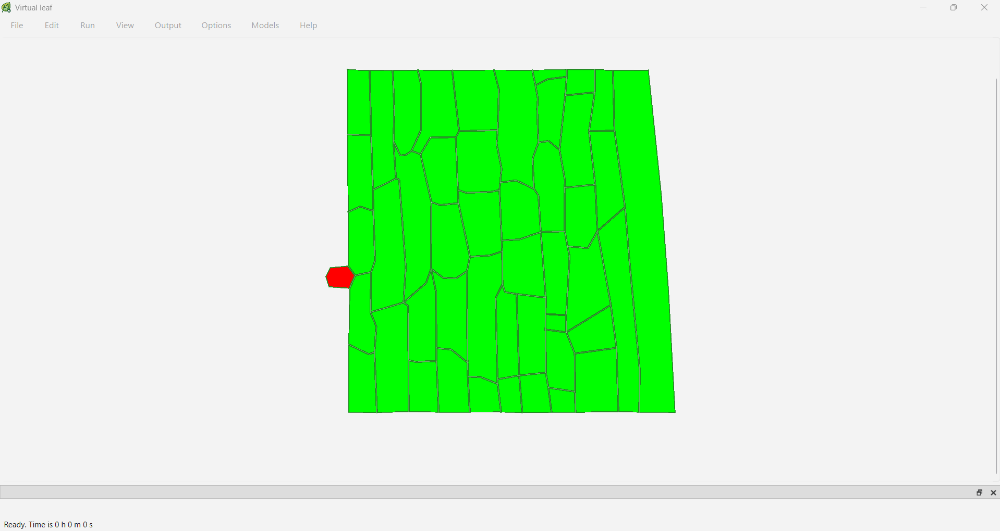
First, we notice how the cells are a bright, uniform green, indicating healthy tissue. Initially, the red pathogen is present as a small, localized element on the left edge, and we see no changes in cells distant from the pathogen.

t=1
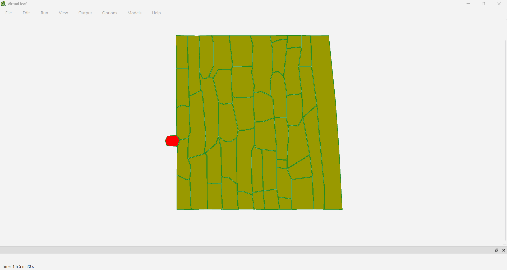
After an hour, we notice how the cells become more yellowish, indicating that the released substance is spreading and is already decreasing the stability of the walls, while the pathogen remains in the same position.

t=2:
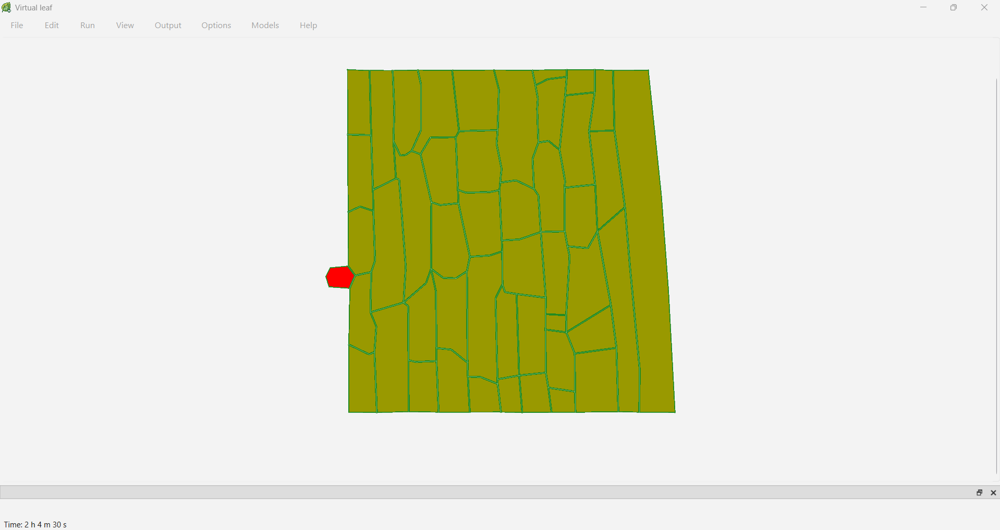
The color has become a little darker than before, showing that the diffusion of the chemical factor is spreading.

t=3:
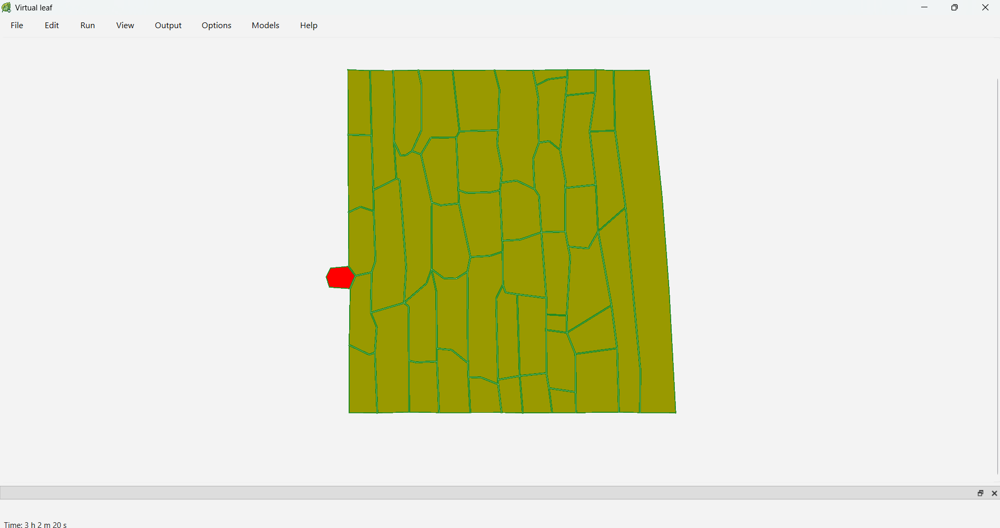
Much of the central tissue has turned brown, and although cell boundaries remain visible, we know the tissue is damaged according to the color scale of the pattern.

t=4:
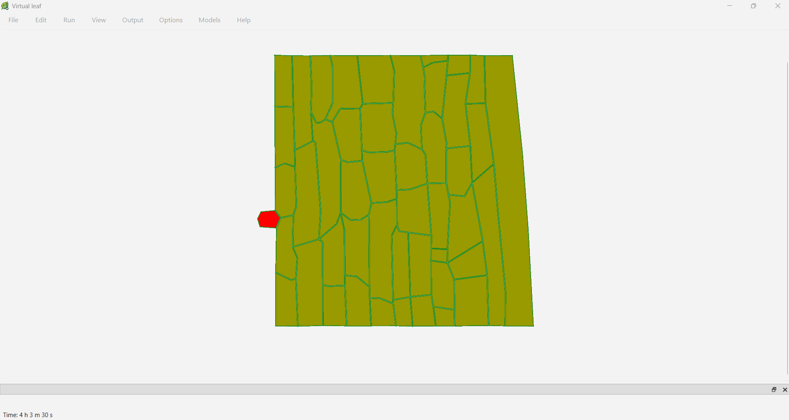
And finally we see how most of the simulated area has been damaged by the pathogen.

Analyzing the images as a whole, we can find a strong change between t=0 and t=1, where almost the entire area turns light brown, and then from t=2 onwards the color remains more or less the same. This happens because initially there is a strong gradient between the pathogenic cell and the surrounding tissue, but after a while a dynamic equilibrium is established.

# Part 2

The `CellHouseKeeping` function defines the behavior rules for each cell during the simulation. Specifically, it controls the growth of the pathogen cell and how the chemical travels through surrounding cells.

First, if the cell is type 2, i.e., the red pathogen, its target area is slightly enlarged (`EnlargeTargetArea(2)`), simulating the pathogen's growth.

Next, the code sets a baseline length for each cell's wall elements, if they don't already have one. This ensures that the structural properties of the cell walls are consistently initialized.

The most important part is the cell wall weakening mechanism. The function controls the level of the chemical released by the pathogen (`patho_chem_level`). If this level is high enough and the cell is not a pathogen, then:

- The cell can grow (`SetCellVeto(false)`),
- The cell wall stiffness is reduced (`setStiffness(stiffness_inf)`), with a reduction proportional to the amount of the pathogenic chemical present.

If the level of the chemical is too low, the cell wall stiffness is maintained at its normal value and the cell is prevented from growing (`SetCellVeto(true)`).

# Part 3

 Take a look at the cell to cell transport and cell dynamics and complete the sketch.
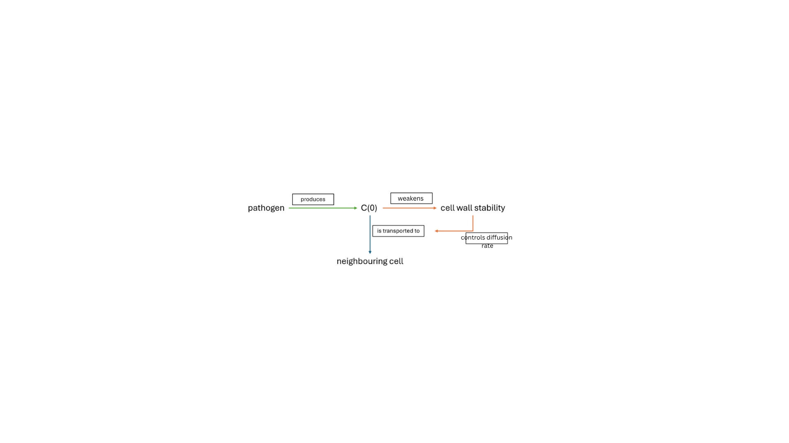
From the cell-to-cell transport and cell dynamics we can see how the infection spreads. The pathogen produces chemical C(0), which weakens the stability of the plant cell wall. When the wall is weakened, diffusion rate it becomes faster, while stronger walls slow down diffusion. This means that the chemical spreads more quickly through weakened cells and more slowly through stable ones. As C(0) diffuses to neighbouring cells, their walls are also weakened, allowing the pathogen to gradually spread through the tissue.

# Part 4
Adjust the diffusion coefficient for the pathogen’s chemical (decrease by a factor of 10, then increase by a factor of 10). Document the simulations and describe in your own words what changes.

First, we look at the D parameter, which is the difussion rate, and see these values: 1e-05,4,0,0,0,0,0,0,0,0,0,0,0,0,0. Since in our code, we only use D[0], which is the diffusion rate for chemical 1, we will decrease it by 10.
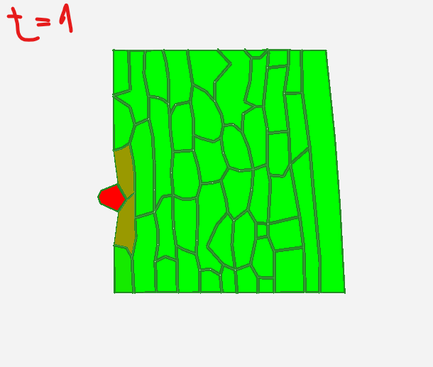
Compared to the images from Part1, we can clearly notice that the difussion is much more slower now. In the first image we can see the tissue at time = 1:00:00.

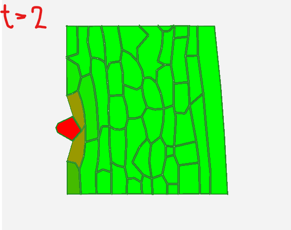
Next image is captured at time = 2:00:00, where we can see that it's not that much of a difference between this and the first image.

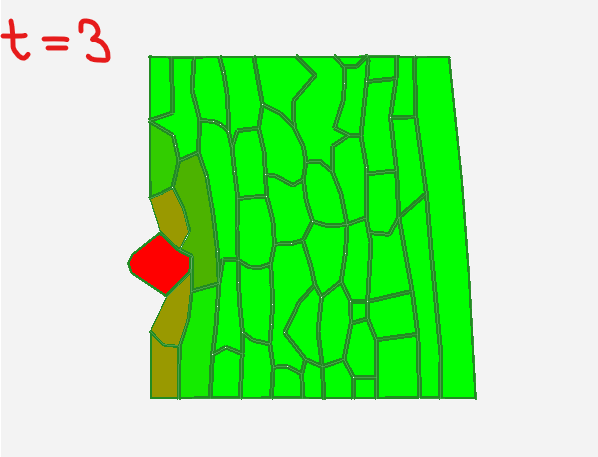
Then, we can see at time = 3:00:00, that the pathogen (red) grows a bit bigger, but still, the difussion is slow, only a few of the cell were targeted.

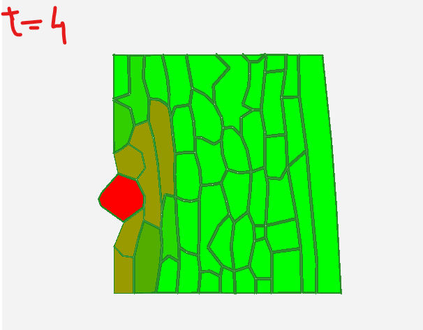
Now, at time = 4:00:00, we notice that the chemical spread more, but still not comparble to the normal diffusion rate.

However, if we multiply the value of the diffusion rate by 10, we can observe a bigger difference.

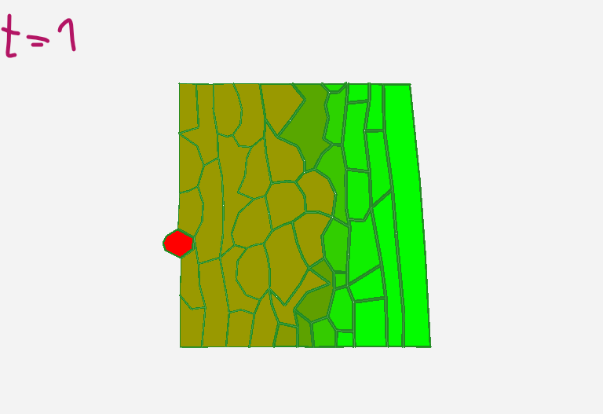
At t = 1:00:00, a much larger region around the pathogen showed reduced wall stability compared to the baseline, which means that the difussion was really fast.

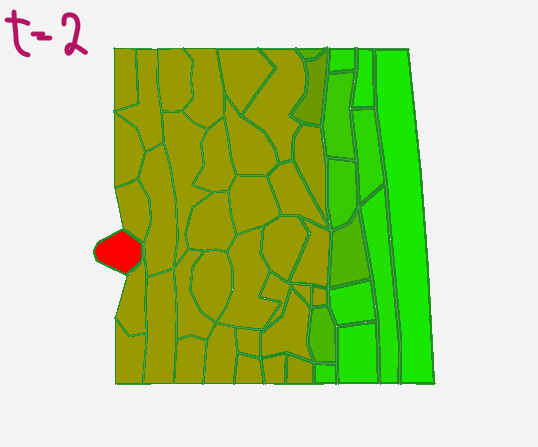
However, between t = 2:00:00, the progression of the infection front was less pronounced, and the spatial extent of weakened cells did not change substantially.

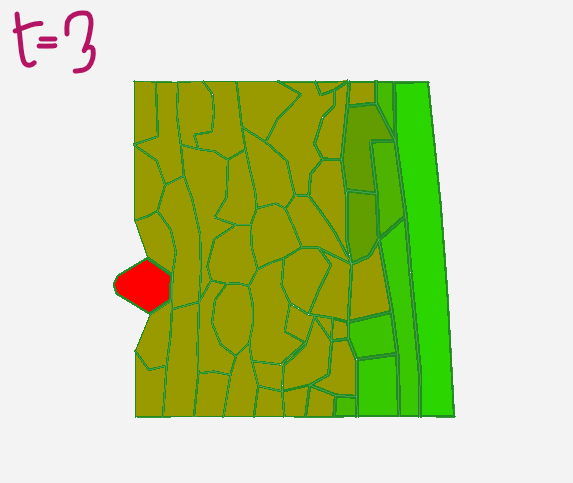
Again, we can not observe any significant difference from 2h to 3h, even tho the pathogen seems to be bigger.

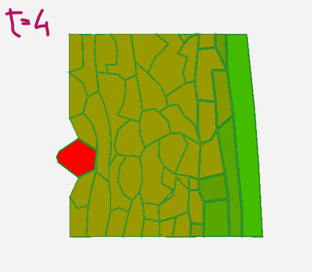
In the end, at time = 4:00:00, we can notice a slightly change in color, a more darker one, which can indicate a more intens absortion of the chemical by the cells that were already infested.
