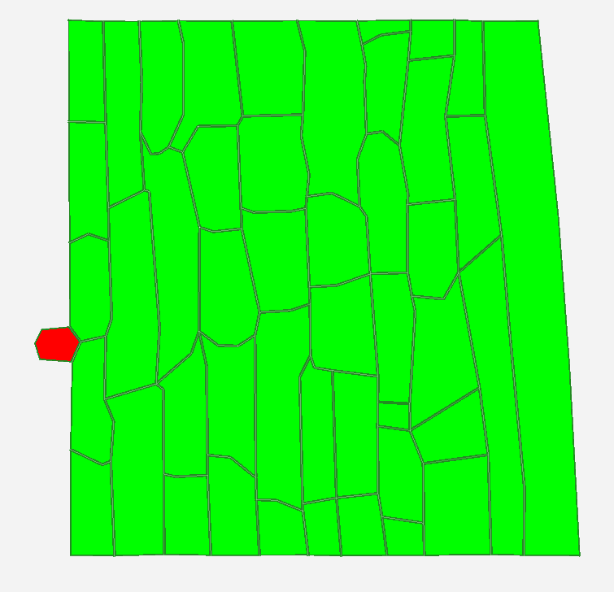
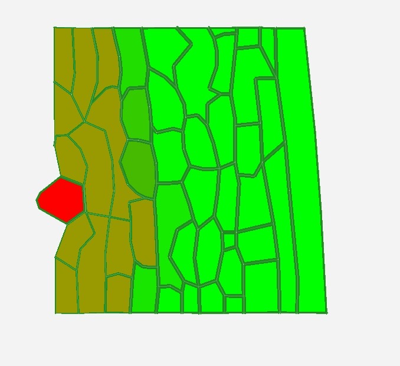

# Part 1
When we ran the model for 4 hours, we observed that the pathogen, the red cell on the left, began to interact with surrounding cells. The pathogen releases a chemical that diffuses into adjacent cells and weakens the cell walls. This phenomenon is visualized by a color change: the healthy, unaffected cells remain bright green, the cells near the pathogen turn brownish, and the pathogen remains red because it continues to release the chemical.

Below we can see how the model changes in 4 hours:

t=0:

First, we notice how the cells are a bright, uniform green, indicating healthy tissue. Initially, the red pathogen is present as a small, localized element on the left edge, and we see no changes in cells distant from the pathogen.

t=1:

In this image, we see how, immediately after infection, the pathogen began spreading its chemical. The closest cells are already showing a color change toward brown, while the rest of the tissue remains green.

t=2:

After two hours, the pathogen began to enter the plant tissue, weakening even more surrounding cells.

t=3:

Now we can notice that the pathogen, in addition to penetrating even further into the plant tissue, has also grown larger, making more and more space between the cells.

t=4:

After four hours we observe how almost half of the tissue has turned brown and therefore weakened, the pathogen has taken hold among the cells and has become even larger, and even if some cells are still bright green, in a few hours they will also turn brown as the pathogen will continue to release chemicals.

# Part 2

The `CellHouseKeeping` function defines the behavior rules for each cell during the simulation. Specifically, it controls the growth of the pathogen cell and how the chemical travels through surrounding cells.

First, if the cell is type 2, i.e., the red pathogen, its target area is slightly enlarged (`EnlargeTargetArea(2)`), simulating the pathogen's growth.

Next, the code sets a baseline length for each cell's wall elements, if they don't already have one. This ensures that the structural properties of the cell walls are consistently initialized.

The most important part is the cell wall weakening mechanism. The function controls the level of the chemical released by the pathogen (`patho_chem_level`). If this level is high enough and the cell is not a pathogen, then:

- The cell can grow (`SetCellVeto(false)`),
- The cell wall stiffness is reduced (`setStiffness(stiffness_inf)`), with a reduction proportional to the amount of the pathogenic chemical present.

If the level of the chemical is too low, the cell wall stiffness is maintained at its normal value and the cell is prevented from growing (`SetCellVeto(true)`).

# Part 3

 Take a look at the cell to cell transport and cell dynamics and complete the sketch.

From the cell-to-cell transport and cell dynamics we can see how the infection spreads. The pathogen produces chemical C(0), which weakens the stability of the plant cell wall. When the wall is weakened, diffusion rate it becomes faster, while stronger walls slow down diffusion. This means that the chemical spreads more quickly through weakened cells and more slowly through stable ones. As C(0) diffuses to neighbouring cells, their walls are also weakened, allowing the pathogen to gradually spread through the tissue.

# Part 4
Adjust the diffusion coefficient for the pathogen’s chemical (decrease by a factor of 10, then increase by a factor of 10). Document the simulations and describe in your own words what changes.

First, we look at the D parameter, which is the difussion rate, and see these values: 1e-05,4,0,0,0,0,0,0,0,0,0,0,0,0,0. Since in our code, we only use D[0], which is the diffusion rate for chemical 1, we will decrease it by 10.

Compared to the images from Part1, we can clearly notice that the difussion is much more slower now. In the first image we can see the tissue at time = 1:00:00.

Next image is captured at time = 2:00:00, where we can see that it's not that much of a difference between this and the first image.

Then, we can see at time = 3:00:00, that the pathogen (red) grows a bit bigger, but still, the difussion is slow, only a few of the cell were targeted.

Now, at time = 4:00:00, we notice that the chemical spread more, but still not comparble to the normal diffusion rate.

However, if we multiply the value of the diffusion rate by 10, we can observe a bigger difference.

At t = 1:00:00, a much larger region around the pathogen showed reduced wall stability compared to the baseline, which means that the difussion was really fast.

However, between t = 2:00:00, the progression of the infection front was less pronounced, and the spatial extent of weakened cells did not change substantially.

Again, we can not observe any significant difference from 2h to 3h. The pathogen continues to grow while the chemical efections continues to spread slowly and the structure of the weakend cell walls evolve along with it.

In the end, at time = 4:00:00, we can notice a slightly change in color, a more darker one, which can indicate a more intens absortion of the chemical by the cells that were already infested. Furthermore, the 100x increase in diffusion rate did not seem to have a significant impact on the growth of the pathogen itself, as the red cell evolution does not differ much between the 2 aforementioned scenarios.

# Part 5
One way for the plants to react to such pathogen infestation is by first sensing the increase in pathogen related chemicals and then responding by releasing its own chemicals to help increase their wall stiffness. The key idea is to protect their wall and disallow the pathogen to decrease the stifness and hence drastically increase the pathogen diffusion rate.

Most of the changes happen in (`Function CellHouseKeeping`) & (`Function CellDynamics`). For the purpose of simplicty lets assume this new checmical does not diffuse to the neighboring cells, and so the proces is internal so we won't change (`Function CelltoCellTransport`). I will provide the psuodo code for this defense mechanism alongside the actual c++ code for increased readibility.

// Cell HouseKeeping 

    void Assignment::CellHouseKeeping(CellBase *c) {
        // add cell behavioral rules here
        if(c->CellType()==2){
            c->EnlargeTargetArea(2);
        }
        // initial cell length setup
        double base_element_length = 25;
        c->LoopWallElements([base_element_length](auto wallElementInfo){
            if(std::isnan(wallElementInfo->getWallElement()->getBaseLength())){
            wallElementInfo->getWallElement()->setBaseLength(base_element_length);
            }
        });

        %%% 

        //cell wall weakening happens here
        double patho_chem_level = c->Chemical(0) / (0.5);

        %%%  defense_chem_level = c.Chemical(1) <- Define the defense chemical !!!!!!!!!!!!!!!!! CHANGE

        if (patho_chem_level > 1.2) {
            patho_chem_level = 1.2;
        }
        double stiffness_inf = 2.5;

        if(patho_chem_level>0.1 && c->CellType()!=2){
            c->SetCellVeto(false);
            stiffness_inf = 2.5 - (patho_chem_level);
        c->LoopWallElements([stiffness_inf](auto wallElementInfo){
            wallElementInfo->getWallElement()->setStiffness(current_stiffness);
        });

        %%%                                                             !!!!!!!!!!!!!!!!! CHANGE
        else if defense_chem_level > 0.1 && c->CellType()!=2{              only non pathogen cells, if defense checmical levels are high
            stiffness_inf += defense_chem_level                       increase stiffeness
            c.SetCellVeto(true)                                   disallow growth since cell spends resources on the chemical production
        }
        %%%%                                                            !!!!!!!!!!!!!!!!! CHANGE

        }
        else{
            c->LoopWallElements([stiffness_inf](auto wallElementInfo){
            wallElementInfo->getWallElement()->setStiffness(stiffness_inf);
            });
            c->SetCellVeto(true);
        }
    }

// Cell Dynamics

    void Assignment::CellDynamics(CellBase *c, double *dchem) {
        // add biochemical networks for intracellular reactions here
        if(c->CellType()==2){
            dchem[0] = 0.1;
        }
        // the fungi is assumed to have a constant chemical level
        else{
            // for all other cells, the chemical is degraded:
            dchem[0] = -0.001 * c->Chemical(0);

        %%%                                                            !!!!!!!!!!!!!!!!! CHANGE
            // Production and degradation of defense chemical (Chem(1))
            If c.Chemical(0) > 0.1:                                         // Plant senses Chem(0) above some  threshold
                dchem[1] = 0.05                                             // produce Chem(1)
            Else:
                dchem[1] = -0.01 * c.Chemical(1) // Chem(1)                 // degrade if no threat
        %%%                                                            !!!!!!!!!!!!!!!!! CHANGE

        }
    }